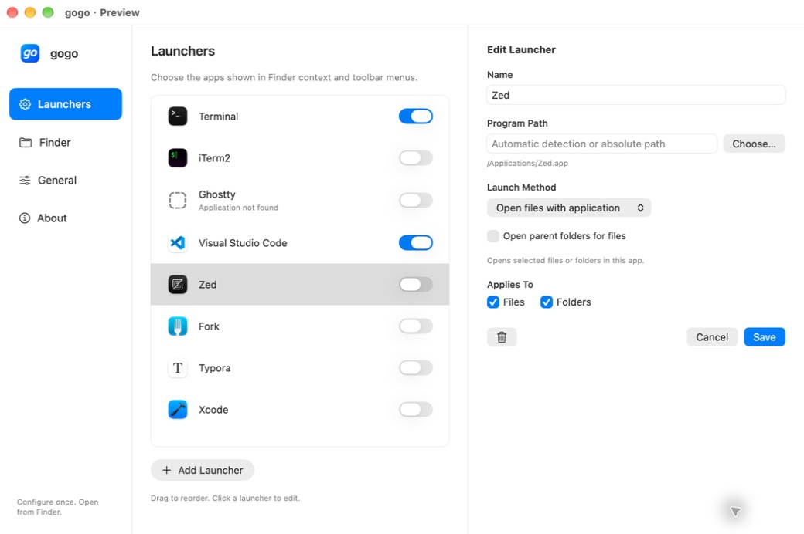
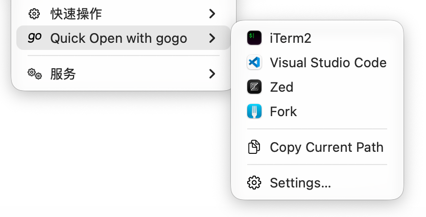
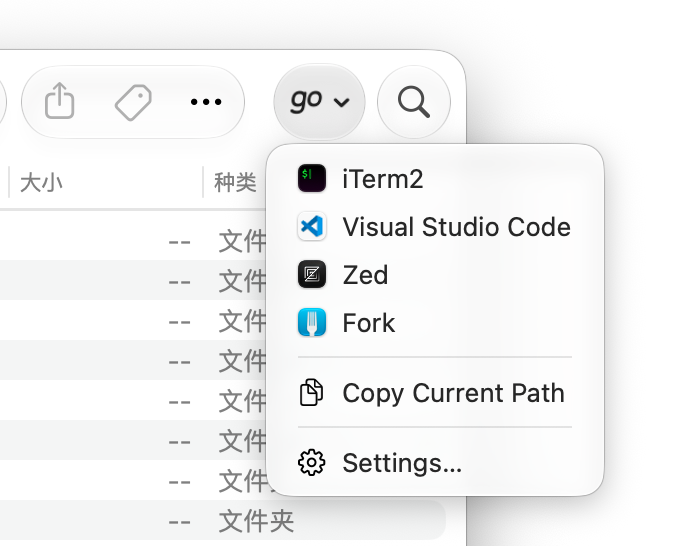

# gogo

English · [简体中文](README.zh-CN.md)


Open Finder selections in your favorite terminal, editor, or custom program.

**Development version, not a compatibility-certified release.** Deployment target: macOS 15.7. Intended coverage: macOS 15.7, 26, and 27. Signed Finder integration still requires validation on each version.



## Finder menus

**Context menu**



**Toolbar menu**



## Features

- Configurable presets for Terminal, iTerm2, Ghostty, Visual Studio Code, Zed, Fork, Typora, and Xcode.
- Custom application or executable paths and one argument per line.
- Finder context submenu and toolbar menu, with a persistent Settings recovery entry.
- Finder menus cover visible mounted volumes, including external drives, and refresh when drives are connected or ejected.
- Drag to reorder launchers; click a row to edit.
- Automatically follows the system language, with English and Simplified Chinese overrides.
- Copy paths from the Finder context menu or toolbar (multiple selections are separated by newlines).
- No menu bar icon or login item.

Presets require individual application and OS validation. Their presence does not imply all integrations have passed.

## Installation

Installing a packaged build does not require Xcode or an Apple developer account. gogo is currently not notarized by Apple, so macOS may block the first launch.

1. Download a packaged build from [GitHub Releases](https://github.com/brookqin/gogo/releases), when available. Extract the ZIP or open the DMG, then drag **gogo.app** into **Applications**.
2. Open gogo. If macOS cannot verify the developer, go to **System Settings → Privacy & Security → Open Anyway**, then confirm **Open**. Only proceed if you trust the download source. See [Apple’s instructions](https://support.apple.com/en-gb/102445).
3. In gogo, open **General → Finder Extension → Manage Extensions** and enable its Finder extension. The System Settings location may vary by macOS version.
4. In Finder, choose **View → Customize Toolbar** and add the gogo button. macOS requests file access when needed during use.

## Build

Requires Xcode and system Python 3; no third-party runtime dependencies. Initially compiled using Xcode 27.

```sh
swift test
./scripts/build.sh CODE_SIGNING_ALLOWED=NO
```

The script generates `gogo.xcodeproj` and builds `.build/xcode/Build/Products/Debug/gogo.app`. Unsigned builds only establish compilation.

For isolated settings UI preview:

```sh
codesign --force --sign - --entitlements Config/Finder.entitlements .build/xcode/Build/Products/Debug/gogo.app/Contents/PlugIns/GogoFinder.appex
codesign --force --sign - --entitlements Config/Gogo.entitlements .build/xcode/Build/Products/Debug/gogo.app
open -n .build/xcode/Build/Products/Debug/gogo.app --args --preview
```

Preview configuration lives under `gogo-preview/configuration.json` in the system temporary directory and does not configure the Finder extension.

## Extension not listed

A settings preview does not establish Finder registration. Keep the extension's sandbox entitlement when signing: re-signing with only `codesign --sign -` removes it, and PlugInKit rejects the extension with `plug-ins must be sandboxed`.

Install the app in `/Applications`, open the installed copy, then check **System Settings → General → Login Items & Extensions → By App → gogo**. On the tested macOS 27 build, Finder Sync appears under the File Providers label. Enablement is a separate user choice.

For a local development registration check:

```sh
pluginkit -a /Applications/gogo.app/Contents/PlugIns/GogoFinder.appex
pluginkit -m -A -D -v -i cn.053x.gogo.finder
```

## Arguments

- **Open files with application** uses LaunchServices and may reuse the running application.
- **Application with arguments** starts a new instance so arguments are delivered at launch.
- **Executable with arguments** runs an absolute executable path with a working directory, without a shell.

Use `{paths}` on its own line for selected paths, one argument per item. Use `{directory}` for the selected directory or a file's parent directory. Do not add shell quotes. Tilde, environment variables, globbing, and shell commands are not expanded. Argument-based launchers currently require a selection that resolves to one working directory; document launchers allow multiple directories.

## Configuration UI

Drag launcher rows to change their order; changes are saved when you drop. Click a row to edit it.

Click **Add Launcher** to create a custom launcher. Use the arrow beside it to restore a removed preset without changing existing launchers.

Choose Follow System, English, or Simplified Chinese in General.

## Contributing

Core models and argument tests are under `Sources/GogoCore` and `Tests/GogoCoreTests`. The host UI is under `Sources/Gogo`; the thin Finder extension is under `Sources/GogoFinder`. Translation resources are in `Resources/en.lproj` and `Resources/zh-Hans.lproj`.

[Selected design](docs/design/selected-concept.png) · [Validation record](docs/VALIDATION.md)

## Acknowledgments

Inspired by the workflow of [OpenInTerminal](https://github.com/Ji4n1ng/OpenInTerminal). gogo is independently implemented in Swift.

## License

[MIT](LICENSE).
