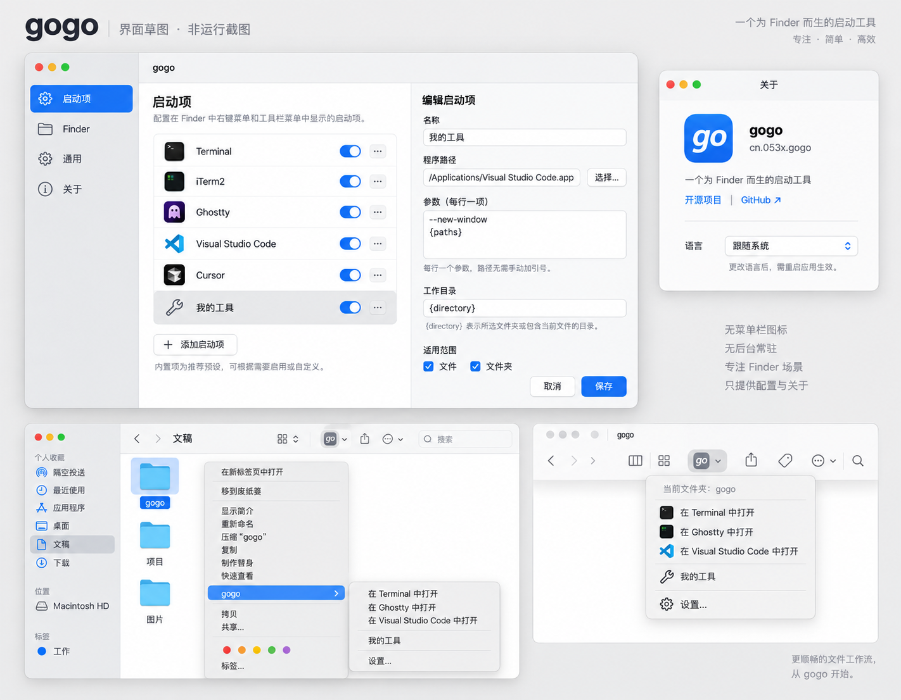

# gogo

[English](README.en.md) · 简体中文


从 Finder 中，用你喜欢的终端、编辑器或自定义程序打开文件与文件夹。

gogo 是从零开发的 Swift macOS 开源项目，受 [OpenInTerminal](https://github.com/Ji4n1ng/OpenInTerminal) 的使用场景启发。主程序只提供配置与关于信息，不创建菜单栏图标或登录项，关闭设置窗口即退出。

**当前为开发版本，不是经过兼容性验收的发行版。** 最低部署目标是 macOS 15.7，目标覆盖 macOS 15.7、26、27。签名后的 Finder 实机验收仍需进行。

## 设计

采用原生分栏设置：启动项、Finder、通用、关于；保留蓝底白色 `go` 图标。



上图是设计参考，不是运行截图。系统管理的 Finder 菜单外观可能随 macOS 版本变化。

## 已实现的第一版代码

- 可编辑、启用、移除和排序的内置启动项；内置 Terminal、iTerm2、Ghostty、Visual Studio Code、Cursor、Xcode 预设。
- 自定义 `.app` 或可执行文件路径，逐行填写启动参数。
- Finder 右键 `gogo` 子菜单与工具栏菜单；菜单保留设置入口，配置失败不会返回完全空白的菜单。
- 中英双语；跟随系统或手动选择。
- 原子写入、版本化的共享配置；损坏或不支持的配置只读报错，不静默覆盖。
- 主程序按需处理启动请求，完成后退出；Finder 扩展由 macOS 管理。

不同终端/编辑器需要逐个验收。预设存在不等于已确认对应应用在所有系统版本下工作。

## 构建

需要 Xcode（首轮使用 Xcode 27 编译），以及系统 Python 3。无第三方运行时依赖。

```sh
swift test
./scripts/build.sh CODE_SIGNING_ALLOWED=NO
```

这会生成 `gogo.xcodeproj`，以及 `.build/xcode/Build/Products/Debug/gogo.app`。未签名构建用于编译检查，不能替代 Finder 扩展安装验收。

仅检查配置 UI，可给本地构建进行临时 ad-hoc 签名并使用隔离的预览配置：

```sh
codesign --force --sign - .build/xcode/Build/Products/Debug/gogo.app/Contents/PlugIns/GogoFinder.appex
codesign --force --sign - .build/xcode/Build/Products/Debug/gogo.app
open -n .build/xcode/Build/Products/Debug/gogo.app --args --preview
```

预览配置位于系统临时目录的 `gogo-preview/configuration.json`，不接入真实 Finder 配置。不要将上述临时签名构建当作发行包。

正式开发安装需在 Xcode 为两个 target 设置同一开发团队，配置 App Group `group.cn.053x.gogo`，并使用正确的签名与 provisioning。Bundle ID：

| Target | Bundle ID |
| --- | --- |
| 主程序 | `cn.053x.gogo` |
| Finder 扩展 | `cn.053x.gogo.finder` |

使用 CLI 签名构建时，可向脚本传入 `DEVELOPMENT_TEAM=你的团队ID CODE_SIGN_IDENTITY="Apple Development"`，证书及 profile 必须已配置。不要提交个人签名资料。

安装后先打开主程序，再在 Finder 页面选择“管理扩展”。入口由系统 API 打开，不硬编码各系统版本的设置 URL；需要在每个目标版本实测。工具栏图标可从 Finder 的“显示 → 自定工具栏”添加。

## 自定义启动项

| 方式 | 行为 |
| --- | --- |
| 用应用打开文件 | 使用 LaunchServices 传递所选路径，复用已运行的应用 |
| 应用与启动参数 | 创建新的应用实例，传入参数；目标应用必须支持对应参数 |
| 可执行文件与参数 | 直接执行绝对路径，设置工作目录，不经过 shell |

每行一个参数，不要给路径添加 shell 引号。例如：

```text
--new-window
{paths}
```

- `{paths}` 必须独占一行，每个选中路径展开为独立参数。
- `{directory}` 可出现在参数中，表示选中文件夹或文件所在目录。
- 不展开 `~`、环境变量、通配符或 shell 命令。程序路径必须是绝对路径。
- 文件打开模式可多选；带参数的启动项暂要求所有选中项目对应同一工作目录，避免默默取第一个目录。
- 可执行文件由用户明确选择并执行，可能持续运行；“gogo 不常驻”不表示它启动的程序会自动退出。

## 结构与验证

- `Sources/GogoCore`：配置与参数展开，可单独执行 Swift Testing 测试。
- `Sources/Gogo`：SwiftUI 设置、AppKit 生命周期、应用启动。
- `Sources/GogoFinder`：薄 Finder Sync 扩展，读取共享配置并传递请求。
- `Resources/{en,zh-Hans}.lproj`：可贡献翻译的文本资源。
- [设计约束](docs/design/DECISIONS.md)、[验证记录](docs/VALIDATION.md)。

## 许可证

[MIT](LICENSE)。本项目独立实现，未复制 OpenInTerminal 源码。
