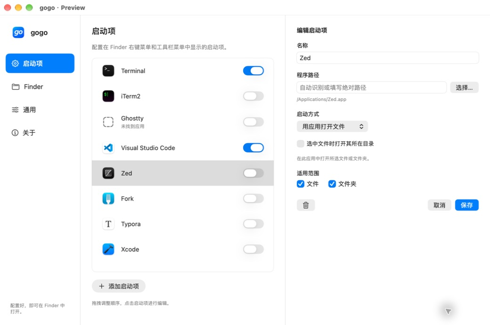

# gogo

[English](README.md) · 简体中文


从 Finder 中，用喜欢的终端、编辑器或自定义程序打开文件与文件夹。

gogo 是独立开发的 Swift macOS 项目，使用场景受 [OpenInTerminal](https://github.com/Ji4n1ng/OpenInTerminal) 启发。主程序只提供设置与关于页面，不创建常驻菜单栏图标或登录项；关闭设置窗口即退出。Finder 扩展由 macOS 管理。

**当前为开发版本，尚未完成跨版本兼容性验收。** 最低部署目标为 macOS 15.7，计划覆盖 macOS 15.7、26、27。签名后的 Finder 集成仍需逐版本实机验证。



## 功能

- 内置 Terminal、iTerm2、Ghostty、Visual Studio Code、Zed、Fork、Typora、Xcode 启动预设。
- 支持自定义应用或可执行文件路径，逐行填写启动参数。
- Finder 右键子菜单与工具栏菜单，并保留设置入口。
- 默认跟随系统语言，也可手动选择 English 或简体中文。
- 拖拽启动项调整顺序，点击行即可编辑，无行末操作菜单。
- 共享配置具有版本标识并原子写入；读取失败时不会静默覆盖原有设置。
- 按需处理启动请求，完成后主程序退出。

各终端和编辑器仍需独立验证；提供预设不代表该应用已在全部目标系统上通过测试。

## 构建

需要 Xcode 和系统 Python 3，无第三方运行时依赖。当前使用 Xcode 27 构建验证。

```sh
swift test
./scripts/build.sh CODE_SIGNING_ALLOWED=NO
```

脚本生成 `gogo.xcodeproj`，构建产物位于 `.build/xcode/Build/Products/Debug/gogo.app`。未签名构建只用于编译检查。

如需使用独立配置预览设置界面：

```sh
codesign --force --sign - .build/xcode/Build/Products/Debug/gogo.app/Contents/PlugIns/GogoFinder.appex
codesign --force --sign - .build/xcode/Build/Products/Debug/gogo.app
open -n .build/xcode/Build/Products/Debug/gogo.app --args --preview
```

预览配置位于系统临时目录下的 `gogo-preview/configuration.json`，不会配置 Finder 扩展。Ad-hoc 签名不能替代正式发行签名。

实际安装 Finder 扩展时，需为两个 Xcode target 配置同一开发团队、有效签名与 provisioning，并使用 App Group `group.cn.053x.gogo`。主程序 bundle ID 为 `cn.053x.gogo`，扩展为 `cn.053x.gogo.finder`。也可向构建脚本传入 `DEVELOPMENT_TEAM=你的团队ID CODE_SIGN_IDENTITY="Apple Development"`。

安装后先打开一次 gogo，再进入 **Finder → 管理扩展**。通过 Finder 的“显示 → 自定工具栏”调整按钮位置；扩展设置入口需要在各目标系统上验证。

## 启动参数

- **用应用打开文件**：通过 LaunchServices 打开所选路径，可复用已运行的应用。
- **应用与启动参数**：启动新的应用实例，以便传入命令行参数。
- **可执行文件与参数**：直接运行绝对路径下的程序并设置工作目录，不经过 shell。

`{paths}` 必须单独占一行，每个所选路径作为独立参数传入。`{directory}` 表示所选文件夹或文件所在目录。无需添加 shell 引号，也不展开波浪号、环境变量、通配符或 shell 命令。

带参数的启动项目前要求所选项目对应同一个工作目录；文件打开方式允许选择多个目录。用户选择运行的程序可能长期运行，gogo 退出不会自动终止它。

## 设置界面

拖拽启动项即可调整顺序，松开后自动保存。点击启动项进入编辑面板。

点击**添加启动项**直接编辑新项目；保存后加入列表，取消则放弃新项目。界面沿用选定的分栏设计与蓝底白色 `go` 图标；关于页只展示产品信息，不展示 bundle ID 或内部实现细节。

已有的语言选择会保留，新配置默认跟随系统。

## 参与开发

配置和参数逻辑位于 `Sources/GogoCore`，测试位于 `Tests`。主程序界面位于 `Sources/Gogo`，Finder 扩展位于 `Sources/GogoFinder`。中英文文本资源分别位于 `Resources/zh-Hans.lproj` 和 `Resources/en.lproj`。

[选定的设计草图](docs/design/selected-concept.png) · [验证记录（英文）](docs/VALIDATION.md)

## 许可证

[MIT](LICENSE)。本项目独立实现，未复制 OpenInTerminal 源码。
